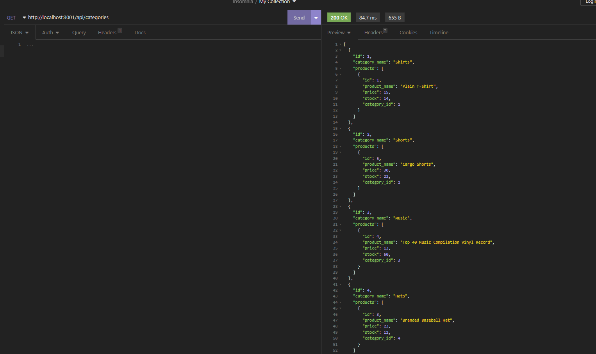

# Module 13: Ecommerce Backend

## User Story

```md
AS A manager at an internet retail company
I WANT a back end for my e-commerce website that uses the latest technologies
SO THAT my company can compete with other e-commerce companies
```

## Acceptance Criteria

```md
GIVEN a functional Express.js API
WHEN I add my database name, MySQL username, and MySQL password to an environment variable file
THEN I am able to connect to a database using Sequelize
WHEN I enter schema and seed commands
THEN a development database is created and is seeded with test data
WHEN I enter the command to invoke the application
THEN my server is started and the Sequelize models are synced to the MySQL database
WHEN I open API GET routes in Insomnia for categories, products, or tags
THEN the data for each of these routes is displayed in a formatted JSON
WHEN I test API POST, PUT, and DELETE routes in Insomnia
THEN I am able to successfully create, update, and delete data in my database
```

## Usage

To use this app, all you need to do is clone the repo. Once you have it cloned locally, you can open it in vscode and run `npm install` in the terminal. You will then run `npm run seed` to seed it and then you can finally run `npm start`. Once you start it up you can head to insomnia and check out the categories, products, and tags!

## Screenshot



## Video Walkthrough
Here is a short video showcasing the app! You can watch it [here](https://drive.google.com/file/d/14wc90yLTbqUqHGmt_QHTd9vItNu7nMcm/view?usp=sharing)
